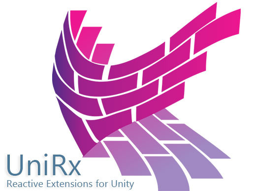

# ZenjectAndUniRxExample
Zenject 및 UniRx 연습용 프로젝트

## 개발환경
- Windows 10
- Unity 2018.3.0f2
- [Zenject Dependency Injection IOC v7.3.1](https://assetstore.unity.com/packages/tools/integration/zenject-dependency-injection-ioc-17758)
- [UniRx - Reactive Extensions for Unity v6.22](https://assetstore.unity.com/packages/tools/integration/unirx-reactive-extensions-for-unity-17276)

## 목표

## 레퍼런스

## Zenject

- [공식 Github](https://github.com/modesttree/Zenject)
- [공식 메뉴얼 번역](~Document/zenject-manual-ko.md)
- [Zenject - Unity Dependency Injection Youtube](https://www.youtube.com/playlist?list=PLyH-qXFkNSxnJbZLrxF0jWGyHB-8Kcd5q)
- [[Unity]Zenject에 배운 DI](https://qiita.com/akihiro_0228/items/d6fe2bfea5306900624d)
- [[Unity]Zenject을 좀 만져 보았다](https://qiita.com/r-ngtm/items/91d655e1162b1d12cac8)
- [Zenject의 Inject Binding 방식들 몇가지 메모](http://lemonheim.blogspot.com/2017/12/zenject-inject-binding.html)

### 관련문서
- [DI](~Document/DI.md)

## UniRx

- [공식 Github](https://github.com/neuecc/UniRx)
- [선행 지식 : C# Linq](~Document/Linq.md)
- [[Unite17] 유니티에서차세대프로그래밍을 UniRx 소개 및 활용 정리](~Document/UniRxExample.md)
- [[UniRx] 미래의 프로그래밍 기술을 Unity로 -UniRx- @toRisouP (작성중)](http://blog.ejonghyuck.net/220414547578)

### UniRx & MVP

- [Unity에서 배울 MVP 패턴 (1) - UniRx을 사용하여 체력 Bar를 만들자](https://qiita.com/nebusokuhibari/items/5e0c36c3b0df78110d32)
- [Unity에서 배울 MVP 패턴 (2) - View 구성 요소를 복수로한다](https://qiita.com/nebusokuhibari/items/f2c3403859422f5c0e20)
- [Unity에서 배울 MVP 패턴 (2) - UniRx 대신 PropertyChangedEventHandler을 사용](https://qiita.com/nebusokuhibari/items/81428f6e5e575318d84a)

### UniRx & Button

- https://uguisudani-media.com/unirx/
- http://ntgame.wpblog.jp/2018/07/15/post-1801/

### UniRx ObservableWWW & UnityWebRequest
- [Obsolete("Use UnityWebRequest, a fully featured replacement which is more efficient and has additional features")]

### 관련문서
- [MV(R)P](~Document/MV(R)P.md)