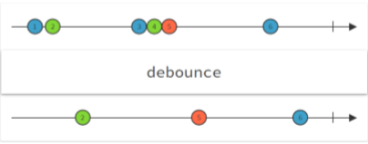
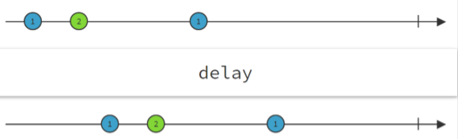

# [Unite17] 유니티에서차세대프로그래밍을 UniRx 소개 및 활용

- [초기 슬라이드 자료 [160402_데브루키_박민근] UniRx 소개 - SlideShare](https://www.slideshare.net/agebreak/160402-unirx)
- [최신 슬라이드 자료](https://www.slideshare.net/agebreak/unite17-unirx)
- [예제 소스](https://github.com/TORISOUP/UniRxExamples)
- [유니티 웹 실행 예제](http://torisoup.net/unirx-examples/)
- [Reactive Programming 이란?](https://www.slideshare.net/jongwookkim/ndc14-rx-functional-reactive-programming)

## [마우스의 더블 클릭 판정] 구현 하실 수 있나요?

How? (기존 방법)
- 최후에 클릭 했을 때부터 일정 시간 이내라면 더블 클릭 판정
- 클릭 횟수 변수와 타이머 변수를 필드에 정의
- Update() 내에 판정 처리를 구현

**귀찮다!!!!!!**

이것을 UniRx를 사용하면 단지 **몇줄**로 끝낼 수 있습니다.

```csharp
var clickStream = Observable.EveryUpdate()
    .Where(_ => Input.GetMouseButtonDown(0));

clickStream.Buffer(clickStream.Throttle(TimeSpan.FromMilliseconds(200)))
    .Where(x => x.Count >= 2)
    .SubscribeToText(text, x => $"DoubleClick detected!\n Count:{x.Count}");
```

단지 이것뿐!!

실제의 사용예를 통해서 UniRx의 대단함과 편리함을 전하고 싶다.

대상 : LINQ는 사용할 수 있는 레벨 (프로그래밍 초보자에게는 조금 어려울지도)

## 1. UniRx란?

- Reactive Extensions for Unity
- MIT 라이센스 공개
- AssetStore or Github에서 다운로드 가능 (무료)

### Reactive Extension

Functional Reactive Programming을 C#에서 구현하기 위한 라이브러리

- LINQ to Events
- 시작은 Microsoft Reseach가 개발 (.NET)
- 최근 들어 유행의 조짐이 오고 있다
    - 다양한 언어로 이식되고 있음
        - RxJS, RxJava, ReactiveCocoa, RxPy, RxLua, UniRx..
    - 어떤 언어라도 Rx의 개념은 같다

### UniRx
- .NET용 Rx은 유니티의 Mono에서는 사용 불가
    - Mono의 .NET 버전 문제
    - 그리고 .NET용 Rx는 무겁고 크다
- UniRx
    - Unity(C#)에서 사용할 수 있게 만든 가볍고 빠른 유니티 전용 Rx
    - Unity 전용으로 사용할 수 있는 Rx 스트림들을 제공
    - 일본에서 개발 (일본어로 된 문서가 많다)

## 2. UniRx가 무엇이 편리한가?
- UniRx를 사용 하면 **시간**의 취급이 굉장히 간단해 집니다.

### 시간이 결정하는 처리의 예
- 이벤트의 기다림
    - 마우스 클릭이나 버튼의 입력 타이밍에 무언가를 처리 할 때   
- 비동기 처리
    - 다른 스레드에서 통신을 하거나, 데이터를 로드할 때
- 시간 측정이 판정에 필요한 처리
    - 홀드, 더블클릭의 판정
- 시간 변화하는 값의 감시
    - False->True가 되는 순간에 1회만 처리하고 싶을 때

이런 처리를 Rx를 사용하면 상당히 간결하게 작성 가능합니다.

### 버튼이 클릭되면 화면에 표시

```csharp
public Button button;
public Text text;

private void Start()
{
    button.onClick // Unity가 제공하는 클릭 이벤트
        .AsObservable() // 이벤트를 스트림으로 변경
        .Subscribe(_ => text.text += "Clicked\n"); // 스트림의 구독 (최종적으로 무엇을 할것인가를 작성)
}
```

#### 스트림

- [이벤트가 흐르는 파이프] 같은 이미지
    - 어렵게 말하자면, [타임라인에 배열되어 있는 이벤트의 시퀀스]
    - 분기 되거나 합쳐지는게 가능하다
- 코드 안에서는 IObservable<T>로 취급된다
    - LINQ에서 IEnumerable<T>에 해당


#### 스트림에 흐르는 이벤트<메시지>

메시지는 3종류가 있다
- OnNext
    - 일반적으로 사용되는 메시지
    - 보통은 이것을 사용한다
- OnError
    - 에러 발생시에 예외를 통지하는 메시지
- OnCompleted
    - 스트림이 완료되었음을 통지하는 메시지

#### 스트림과 버튼 클릭

버튼은 **[클릭 때에 이벤트를 스트림에 보낸다]** 라고 생각하는 것이 가능하다


#### Subscribe (스트림의 구독)

- 스트림의 말단에서 메시지가 올때 무엇을 할 것인지를 정의 한다
- 스트림은 Subscribe 된 순간에 생성 된다
    - 기본적으로 Subscribe하지 않는 한 스트림은 동작하지 않는다
    - Subscribe 타이밍에 의해서 결과가 바뀔 가능성이 있다
- OnError, OnComplete가 오면 Subscribe는 종료된다.


#### Subscribe와 메시지
- Subscribe는 오버로드로 여러 개 정의되어 있어서, 용도에 따라 사용하는게 좋다
    - OnNext만
    - OnNext & OnCompleted
    - OnNext & OnError & OnCompleted

```csharp
// ObservableWW Obsolete 2018.3
ObservableWWW.Get("http://unity-chan.com/")
    .Subscribe(result =>
    {
        // OnNext
        Debug.Log(result);
    }, ex =>
    {
        // OnError
        Debug.LogError(ex);
    }, () =>
    {
        // OnCompleted
        Debug.Log("Done!");
    });
```

### 전체 흐름

```csharp
public Button button;
public Text text;

private void Start()
{
    // 버튼 클릭 이벤트를 스트림으로 변경해서 메시지가 도착할 때에 텍스트에 "Clicked"를 표시한다.
    button.onClick 
        .AsObservable() 
        .Subscribe(_ => text.text += "Clicked\n");
}
```

### Subscribe의 타이밍

- Awake() / Start()에서 Subscribe 해야 한다.
- Update()에 쓰면 무수한 스트림이 생성 된다.

### 보너스

```csharp
button
    .OnClickAsObservable()
    .SubscribeToText(text, _ => text.text += "clicked\n");
```
- UniRx에는, UGUI용의 Obserable과 Subscribe가 준비되어 있다. 앞의 내용을 이걸로 간략화 할 수 있다.

## 3. 스트림을 사용하는 메리트와 예
- 이벤트의 투영, 필터링, 합성등이 가능하다.

### 버튼이 3회 눌리면 Text에 표시한다
- 버튼이 클릭된 횟수를 카운트 한다?
    - 카운트용의 변수를 필드에 정의 한다?
- Buffer(3)을 추가만 하면 된다.
    - 굳이 필드 변수 추가 필요 없다.
    - 혹은 Skip(2)로도 똑같은 동작을 한다.
        - 여기에서는 이해를 돕기위해 Buffer을 사용했지만, n회후에 동작하는 경우에는 Skip 쪽이 적절하다.

```csharp
button.OnClickAsObservable()
    .Buffer(3)
    .SubscribeToText(text, _ => text.text + "clicked\n");
```

#### Buffer
- 메시지를 모아서 특정 타이밍에 보낸다
    - 방출 조건은 여러가지 지정이 가능하다
        - n개 모아서 보내기
        - 다른 스트림에 메시지가 흐르면, 보내기


### Button이 둘 다 눌리면 Text에 표시 한다
- 양쪽이 교차로 1회씩 눌릴 때 Text에 표시한다
    - 연타하더라도 [1회 눌림]으로 판정한다

```csharp
button1.OnClickAsObservable()
    .Zip(button2.OnClickAsObservable(), (b1, b2) => "Clicked!")
    .First() // 1번 동작한 후에
    .Repeat() // Zip내의 버퍼를 클리어 한다
    .SubscribeToText(text, x => text.text + x + "\n");
```

### Zip
- 여러 개의 스트림의 메시지가 완전히 모일때까지 기다림
    - 메시지가 모인때에 하나의 이벤트로 취급해서 보낸다
    - 합쳐진 메시지는 임의로 가공해서 출력이 가능하다


### Rx 정리
- Rx을 사용하지 않는 종래의 방법에서 이벤트를 받은 후에 어떻게 할것인가를 작성 하였다.
- Rx에서는 이벤트를 받기 전에 무엇을 하고 싶다를 작성한다
- [스트림을 가공해서 자신이 받고 싶은 이벤트만 통지 받으면 좋잖아!]

정리하면 Rx는
1. 스트림을 준비해서
2. 스트림을 오퍼레이터로 가공 해서
3. 최후에 Subscribe 한다
라는 개념으로 사용 된다.

## 4. 자주 사용하는 오퍼레이터 설명

오퍼레이터 : 스트림을 조작하는 메소드

스트림에 조작을 가하는 함수 (무진장 많다!)
```
Select, Where, Skp, SkipUntil, SkipWhile, Take, TakeUntil, TakeWhile, Throttle, Zip, Merge, CombineLatest, Distinct, DistinctUntilChanged, Delay, DelayFrame, First, FirstOfDefault, Last, LastOfDefault, StartWith, Concat, Buffer, Cast, Catch, CatchIgnore, ObserveOn, Do, Sample, Scan, Single, SingleOrDefault, Retry, Repeat, Time, TimeStamp, TieInterval..
```
다른 말로 자신이 구현하고 싶은 기능들은 왠만하면 제공되는 오퍼레이터로 구현할 수 있다!

### Where
- 조건을 만족하는 메시지만 통과 시키는 오퍼레이터
    - 다른 언어에서는 [filter]라고도 한다.


### Select
- 요소의 값을 변경한다
    - 다른 언어에서는 [map]이라고 한다.


### SelectMany
- 새로운 스트림을 생성하고, 그 스트림이 흐르는 메시지를 본래의 스트림의 메시지로 취급
    - 스트림을 다른 스트림으로 교체하는 이미지 (정밀히 말하면 다름)
    - 다른 언어에서는 [flatMap]이라고도 한다.


### Throttle/ThrottleFrame
- 도착한 때에 최후의 메시지를 보낸다
    - 메시지가 집중해서 들어 올때에 마지막 이외를 무시 한다
    - 다른 언어에서는 [debounce]라고도 한다
    - 자주 사용됨



### ThrottleFirst/ThrottleFirstFrame
- 최초에 메시지가 올때부터 일정 시간 무시한다.
    - 하나의 메시지가 온때부터 잠시 메시지를 무시한다
    - 대용량으로 들어오는 데이터의 첫번째만 사용하고 싶을 때 유효


### Delay/DelayFrame
- 메시지의 전달을 연기한다.



### DistinctUntilChanged
- 메시지가 변화한 순간에만 통지한다
    - 같은 값이 연속되는 경우에는 무시한다


### SkipUntil
- 지정한 스트림에 메시지가 올때까지 메시지를 Skip 한다.
    - 같은 값이 연속되는 경우에는 무시한다.


### TakeUntil
- 지정한 스트림에 메시지가 오면, 자신의 스트림에 OnCompleted를 보내서 종료한다.


### Repeat
- 스트림이 OnCompleted로 종료될 때에 다시 한번 Subscribe를 한다.

### SkipUntil + TakeUntil + Repeat
- 자주 사용되는 조합
    - 이벤트 A가 올때부터 이벤트 B가 올때까지 처리를 하고 싶을때 사용

예) 드래그로 오브젝트를 회전 시키기
- MouseDown이 올 때부터 Mouse up이 올때까지 처리할 때
```csharp
public class MouseDrag : MonoBehaviour
{
    private float _rotationSpeed = 500.0f;
    void Start()
    {
        // OnMouseDown과 OnMouseUp의 조합으로 드래그 만 처리하는
        this.UpdateAsObservable() // Update ()의 타이밍을 알려 Observable
            .SkipUntil(this.OnMouseDownAsObservable()) // 마우스가 클릭 될 때까지 스트림을 무시
            .Select(_ => new Vector2(Input.GetAxis("Mouse X"), Input.GetAxis("Mouse Y"))) // 마우스의 이동량을 스트림에 흐르는
            .TakeUntil(this.OnMouseUpAsObservable()) // 마우스를 놓을 때까지
            .Repeat() // TakeUntil 스트림이 종료하기 때문에 다시 Subscribe
            .Subscribe(move =>
            {
                // 개체를 드래그하여 개체를 회전
                transform.rotation =
                    Quaternion.AngleAxis(move.y * _rotationSpeed * Time.deltaTime, Vector3.right)
                    * Quaternion.AngleAxis(move.x * _rotationSpeed * Time.deltaTime, Vector3.up)
                    * transform.rotation;

            });
    }
}
```

### First

스트림에 최초로 받은 메시지만 보낸다
- OnNext 직후에 OnComplete도 보낸다


### 앞의 Zip 예제에서 First + Repat를 사용한 의도

- First + Repeat로 1회 동작할때마다 스트림을 다시 만든다 (Zip내의 메시지큐를 리셋하기 위해)
```csharp
button1.OnClickAsObservable()
    .Zip(button2.OnClickAsObservable(), (b1, b2) => "Clicked!")
    .First()
    .Repeat()
    .SubscribeToText(text, x => text.text + x + "\n");
```

## 5. Unity에서의 실용 사례 5가지

### 1. 더블 클릭 판정

```csharp
// 클릭 스트림을 정의
var clickStream = this.UpdateAsObservable()
    .Where(_ => Input.GetMouseButtonDown(0));
```


```csharp
// buffer : 클릭 스트림을 멈춰둔다 개방조건은
// throttle : 최후에 클릭된 이후 200미리초 경과할 때
clickStream.Buffer(clickStream.Throttle(TimeSpan.FromMilliseconds(200)))
    .Where(x => x.Count >= 2)
    .SubscribeToText(text, x => $"DoubleClick detected!\n Count:{x.Count}");
```


- buffer의 해제는 throttle를 사용하여 해제한다.
- throttle은 마지막에 값이 오고 나서 일정시간 경과하면 발생한다.
- 첫번째 클릭 이후 0.2초 후에 throttle이 발생하고, 그 이후 버퍼가 해제되면서 where 조건을 검사해 2 이상이면 where 절을 통과하고 Subscribe가 된다.

### 2. 값의 변화를 감시하기

#### 플레이어가 지면에 떨어지는 순간에 이펙트를 발생

지면에 떨어진 순간의 감지 방법
1. CharacterController.isGrounded를 매 프레임 체크
2. 현재 프레임의 값을 필드 변수에 저장
3. 매프레임에 False -> True로 변화할 때에 이펙트를 재생한다.

기존 방법
```csharp
public class OnGroundedWithoutUniRx : MonoBehaviour
{
    public CharacterController characterController;
    public ParticleSystem particleSystem;
    private bool _oldFlag;

    void Start()
    {
        _oldFlag = characterController.isGrounded;
    }

    void Update()
    {
        bool cntFlag = characterController.isGrounded;
        if (cntFlag && !_oldFlag)
        {
            particleSystem.Play();
        }
        _oldFlag = cntFlag;
    }
}
```
- 훅 보면 뭘 하는지 판단하기 어렵다!
- 플래그가 2개 필요하다. (oldFlag, cntFlag)

unirx를 사용한 방법
```csharp
public class OnGroundedUniRx : MonoBehaviour
{
    public CharacterController characterController;
    public ParticleSystem particleSystem;

    void Start()
    {
        this.UpdateAsObservable()
            .Select(_ => characterController.isGrounded)
            .DistinctUntilChanged()
            .Where(x => x)
            .Subscribe(_ => particleSystem.Play());
    }
}
```


#### ObserveEveryValueChanged

- 매 프레임 값의 변화를 감시한다면 [ObserveEveryValueChanged]의 쪽이 심플하다

```csharp
characterController
    .ObserveEveryValueChanged(x => x.isGrounded)
    .Where(x => x)
    .Subscribe(_ => particleSystem.Play());
```

### 3. 값의 변화를 가다듬기

### 4. WWW를 사용하기 쉽게 하기

### 5. 기존 라이브러리를 스트림으로 변환하기

## 6. 정리